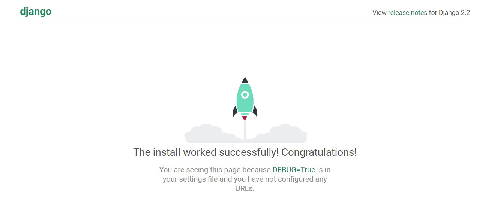
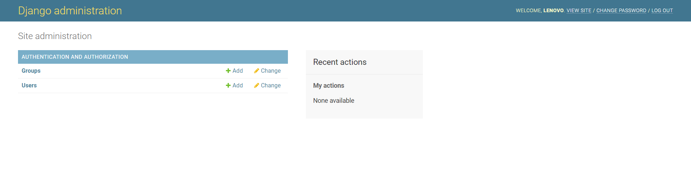
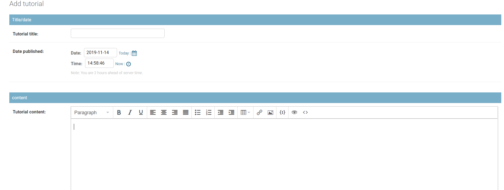
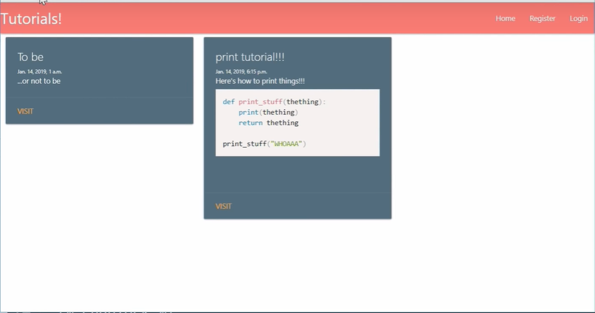
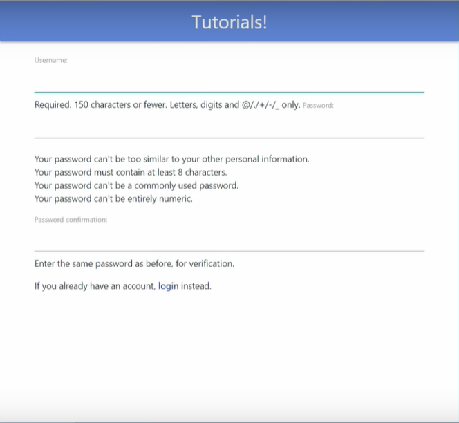

# Python Tutorial website

## Getting Started

install Django

```bash
pip install django
```

start a project a new project

```bash
django-admin startproject mysite
```

create a main

```bash
cd mysite
py manage.py startapp main
```

run the server to check if every think is working

```bash
py manage.py runserver
```



## Routes

Add the below code to the urls.py to create a route for the emply url

```python
from django.urls import path
from . import views

app_name = "main"
urlpatterns = [
    path("", views.homepage, name="homepage"),
```

## Create Models

create a model, a tutorial table, we need to edit the file models.py

```python
from django.db import models

# Create your models here.


class Tutorial(models.Model):
    tutorial_title = models.CharField(max_length=200)
    tutorial_content = models.TextField()
    tutorial_published = models.DateTimeField("date published")

    def __str__(self):
        return self.tutorial_title

```

then we need to make migration then we migrate

```bash
python manage.py makemigrations
python manage.py migrate
```

## Admin Page

Create and admin page, for that we need an admin user

```bash
python manage.py createsuperuser
```

provide username, email and password.
Type in the url http://127.0.0.1:8000/admin, and type the username and password



Add the models to the admin page

```python
from django.contrib import admin
from .models import Tutorial
# Register your models here.

admin.site.register(Tutorial)
```

## Views and Templates

Install a text editor called tinymce4-lite

```bash
pip install django-tinymce4-lite
```



modify the view to show the models

```python
<head>
   <link href=""
  rel="stylesheet"
</head>
<body>
  
  <p>{{tut.tutorial_title}}</p>
  <p>{{tut.tutorial_published}}</p>
  <p>{{tut.tutorial_content|safe}}</p>
  
</body>
<script src=""></script>
```

## Styling and CSS

We are going to user css framework called Materialize, so we add the below code to the head of the home page

```html
<link
  rel="stylesheet"
  href="https://cdnjs.cloudflare.com/ajax/libs/materialize/1.0.0/css/materialize.min.css"
/>

<!-- Compiled and minified JavaScript -->
<script src="https://cdnjs.cloudflare.com/ajax/libs/materialize/1.0.0/js/materialize.min.js"></script>
```
Add Navbar and cards



we need to modify something in particular in the materialize framework, for that reason we download the SASS files from [Here](http://materializecss.com/getting-started.html), then we download Koala from [Here](https://koala-app.com) to compile the SASS.

Choose the modificaiton that you need to do then compile the SASS file using Koala.

## User Registration

create a new webpage for registration and a new view

register.html
```html
 
<form method="POST">
  
  {{ form }}
</form>
if you already have an account, <a href="/login">login</a> instead. 
```

add it to view.py

```python
def register(request):
    form = UserCreationForm
    return render(request, "main/register.html", context={"from": form})
```

add it to urls.py

```python
path("register/", views.register, name="register")
```


## Messages and Includes

include a library then use it to create messages
```python
from django.contrib import messages


  if form.is_valid():
            user = form.save()
            username = form.cleaned_data.get('username')
            messages.success(request, f"New Account Created: {}")
            login(request, user)
            return redirect("main:homepage")
        else:
            for msg in form.error_messages:
                messages.error(request, f"{msg}:form.error_messages[msg]")
```

use a toast from Materialized 

```python
<script>
    M.toast({
      html: '{{message}}',
      classes: 'blue rounded',
      displayLenght: 2000
    });
  </script>
```

## User Login and Logout 

Add a path for logout view

```python
path("logout/", views.logout_request, name="logout"),
```

Add a logout view

```python
def logout_request(request):
    logout(request)
    messages.info(request, "Logged out successfully!")
    return redirect("main:homepage")
```

Add a path for login view

```python
path("logout/", views.login_request, name="login"),
```

Add a login view

```python
def login_request(request):

    if request.method == "POST":
        form = AuthenticationForm(request, data=request.POST)
        if form.is_valid():
            username = form.cleaned_data('username')
            password = form.cleaned_data('password')
            user = authenticate(username, password)
            if user is not None:
                login(request, user)
                messages.info(request, "")

    form = AuthenticationForm()
    return render(request, "main/login.html", {"form": form})
```

create a new form

```python
from django import forms
from django.contrib.auth.forms import UserCreationForm
from django.contrib.auth.models import UserCreationForm

class NewUserForm(UserCreationForm):
    email=forms.EmailField(required=True)

    class Meta:
        model=User
        fields=("username","email","password1","password2")
        
        def save(self,commit=True):
            user=super(NewUserForm,self).save(commit=False)
            user.email=self.cleaned_data['email']
            if commit:
                user.save()
            return user
```